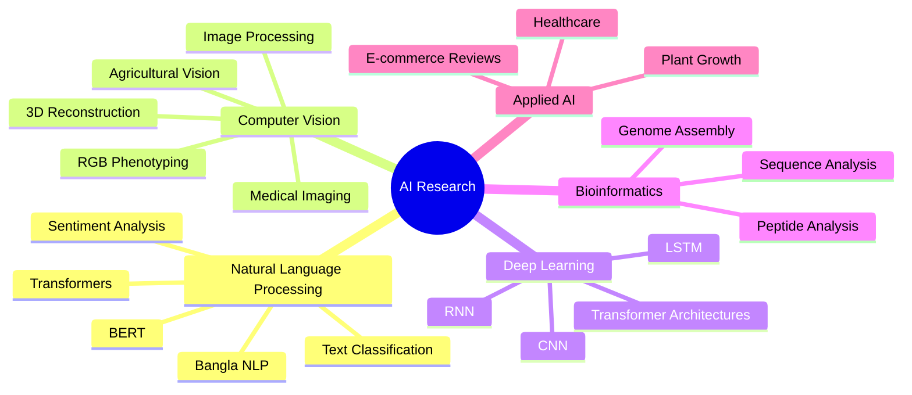

<div align="center">

<!-- ============================================================= -->

<!--                         HERO SECTION                          -->

<!-- ============================================================= -->


<a href="https://readme-typing-svg.demolab.com">
  
</a>

<br/>


<br/><br/>

<a href="mailto:saimimislam@gmail.com">
  
</a>

<a href="https://github.com/saimim">
  
</a>

<a href="www.linkedin.com/in/saimim">
  
</a>

</div>

<br/>

<div align="center">


</div>

<!-- ============================================================= -->

<!--                         ABOUT ME                              -->

<!-- ============================================================= -->

<div align="center">


</div>

<br/>

```python
from dataclasses import dataclass, field


@dataclass
class SaimimIslamKhanHamim:
    name: str = "Md. Saimim Islam Khan Hamim"

    role: str = "MSc Researcher & Lecturer"

    research_domains: list[str] = field(default_factory=lambda: [
        "Bangla Natural Language Processing",
        "Computer Vision",
        "Deep Learning",
        "Machine Learning",
    ])

    current_focus: list[str] = field(default_factory=lambda: [
        "Plant Growth Stage Estimation",
        "Cross-Crop Generalisation",
        "RGB-Based Phenotyping",
        "Agricultural Computer Vision",
    ])

    research_interests: list[str] = field(default_factory=lambda: [
        "NLP",
        "Computer Vision",
        "Transformer Architectures",
        "Medical Imaging",
        "Agricultural AI",
    ])

    open_to: list[str] = field(default_factory=lambda: [
        "Research Collaboration",
        "Academic Projects",
        "Open Source",
        "AI/ML Discussions",
    ])

    motto: str = "Research. Build. Learn. Share."
```

> I am a Computer Science graduate and active researcher working at the intersection of **Natural Language Processing, Computer Vision, and Deep Learning**.
>
> My research interests include **Bangla NLP, sentiment analysis, transformer-based models, agricultural computer vision, and RGB-based phenotyping**. I am currently pursuing an MSc in Computer Science and Engineering with a focus on **Data Science, Advanced Machine Learning, and Research Methodology**, while contributing to academic teaching and research at Daffodil International University.

<br/>

<div align="center">


</div>

<!-- ============================================================= -->

<!--                         RESEARCH FOCUS                        -->

<!-- ============================================================= -->

<div align="center">


</div>

<br/>

<div align="center">

| Area | Focus                                  |
| :--: | :------------------------------------- |
|  🧠  | **Natural Language Processing**        |
| 🇧🇩 | **Bangla NLP & Sentiment Analysis**    |
|  👁️ | **Computer Vision**                    |
|  🌱  | **Agricultural Computer Vision**       |
|  🧬  | **Bioinformatics & Sequence Analysis** |
|  🤖  | **Deep Learning & Transformers**       |
|  🏥  | **Medical Imaging & Visual Analysis**  |

</div>

<br/>

### Current Research Direction

My current research work focuses on **plant growth stage estimation and cross-crop generalisation using low-cost RGB cameras**, extending my broader interests in computer vision, machine learning, and practical AI systems.

---

<!-- ============================================================= -->

<!--                         EXPERIENCE                            -->

<!-- ============================================================= -->

<div align="center">


</div>

<br/>

### 🎓 Lecturer (Contractual)

**Department of Software Engineering — Daffodil International University**

`May 2026 — August 2026`

* Taught undergraduate courses in the Department of Software Engineering.
* Conducted academic activities and supported undergraduate learning.
* Contributed to departmental teaching responsibilities.

---

### 🧑‍🏫 Graduate Teaching Assistant

**Department of Information Technology & Management — Daffodil International University**

`July 2025 — April 2026`

* Assisted faculty with academic tasks and course documentation.
* Managed and calculated student marks.
* Prepared lecture content and presentation materials.
* Organised course materials.
* Supported communication between students and faculty.

---

### 🔬 Secretary General

**Health Informatics Research Lab (HIRL) — Daffodil International University**

`February 2025 — December 2025`

* Managed research lab operations.
* Coordinated research activities.
* Facilitated communication among lab members and faculty supervisors.

---

### 🧠 Mentor — Machine Learning for Research Bootcamp

**DIU Computer Programming Club (CPC)**

`October 2024 — April 2025`

* Mentored participants in machine learning concepts.
* Supported participants with ML tools and research methodology.
* Contributed to a structured machine learning research bootcamp.

<br/>

<div align="center">


</div>

<!-- ============================================================= -->

<!--                         EDUCATION                             -->

<!-- ============================================================= -->

<div align="center">


</div>

<br/>

<table align="center">
<tr>
<td width="50%" valign="top">

### 🎓 MSc in Computer Science & Engineering

**Daffodil International University**

`May 2026 — Present`

📍 Dhaka, Bangladesh

**Focus Areas**

* Data Science
* Advanced Machine Learning
* Research Methodology

</td>

<td width="50%" valign="top">

### 🎓 BSc in Computer Science & Engineering

**Daffodil International University**

`May 2021 — May 2025`

📍 Dhaka, Bangladesh

**CGPA:** `3.52 / 4.00`

**Research Areas**

* Machine Learning
* Deep Learning
* NLP
* Computer Vision

</td>
</tr>
</table>

<br/>

<div align="center">

| Qualification     | Institution              |      Result     |
| :---------------- | :----------------------- | :-------------: |
| **HSC — Science** | Savar Government College | **4.33 / 5.00** |
| **SSC — Science** | Badda High School        | **4.61 / 5.00** |

</div>

<br/>

<div align="center">


</div>

<!-- ============================================================= -->

<!--                         PUBLICATIONS                          -->

<!-- ============================================================= -->

<div align="center">


</div>

<br/>

### 01 · A Comparative Study of Transformer-Based Models and Machine Learning Techniques for Enhancing Bangla Sentiment Analysis

**ECAI 2025 — 17th International Conference on Electronics, Computers and Artificial Intelligence**

📍 Romania · **IEEE Xplore** · `2025`

**Authors:** Md. Saimim Islam Khan Hamim, Ishtiaque Ahmed, Tawhidul Islam Sazid, et al.

**DOI:** `10.1109/ECAI65401.2025.11095616`

---

### 02 · 3D Reconstruction of Colonic Polyps: A Methodology for Improved Visualization and Analysis

**ECCE 2025 — International Conference on Electrical, Computer and Communication Engineering**

📍 Bangladesh · **IEEE Xplore** · `2025`

**Authors:** Ishtiaque Ahmed, Pranto Saha, Md. Saimim Islam Khan Hamim, et al.

**DOI:** `10.1109/ECCE64574.2025.11013942`

---

### 03 · Enhancing Sentiment Analysis Accuracy in E-commerce: An Integrated NLP Approach to Amazon Review Classification

**ICACTCE'24 — 4th International Conference on Advances in Communication Technology and Computer Engineering**

📍 Morocco · **Springer LNNS, Volume 6** · `2024`

**Authors:** Md. Saimim Islam Khan Hamim, Md. Alif Sheakh, Ishtiaque Ahmed, et al.

**DOI:** `10.1007/978-3-031-94623-3_23`

<br/>

<div align="center">


</div>

<br/>

<div align="center">


</div>

<!-- ============================================================= -->

<!--                       TECHNICAL ARSENAL                       -->

<!-- ============================================================= -->

<div align="center">


</div>

<br/>

### 🐍 Programming Languages

<p align="center">


</p>

### 🧠 Machine Learning & Deep Learning

<p align="center">


</p>

<p align="center">


</p>

### 🗣️ Natural Language Processing

<p align="center">


</p>

### 👁️ Computer Vision

<p align="center">


</p>

### 🧬 Bioinformatics

<p align="center">


</p>

### 📝 Research & Productivity

<p align="center">


</p>

<br/>

<div align="center">


</div>

<!-- ============================================================= -->

<!--                      RESEARCH MAP                             -->

<!-- ============================================================= -->

<div align="center">


</div>

<br/>



<br/>

<!-- ============================================================= -->

<!--                       GITHUB STATS                            -->

<!-- ============================================================= -->

<div align="center">


</div>

<br/>

<div align="center">

<a href="https://github.com/saimim">


</a>

<a href="https://github.com/saimim">


</a>

</div>

<br/>

<div align="center">


</div>

<br/>

<div align="center">


</div>

<br/>

<div align="center">


</div>

<!-- ============================================================= -->

<!--                         CONNECT                               -->

<!-- ============================================================= -->

<div align="center">


</div>

<br/>

<div align="center">

I am interested in **research collaboration, academic projects, machine learning,
NLP, computer vision, and open-source AI projects.**

<br/><br/>

<a href="mailto:saimimislam@gmail.com">

</a>

<a href="https://github.com/saimim">

</a>

<a href="www.linkedin.com/in/saimim">

</a>

</div>

<br/>

<!-- ============================================================= -->

<!--                          FOOTER                               -->

<!-- ============================================================= -->

<div align="center">


<sub>

<strong>Researching language. Understanding vision. Building intelligent systems.</strong>

</sub>

</div>
